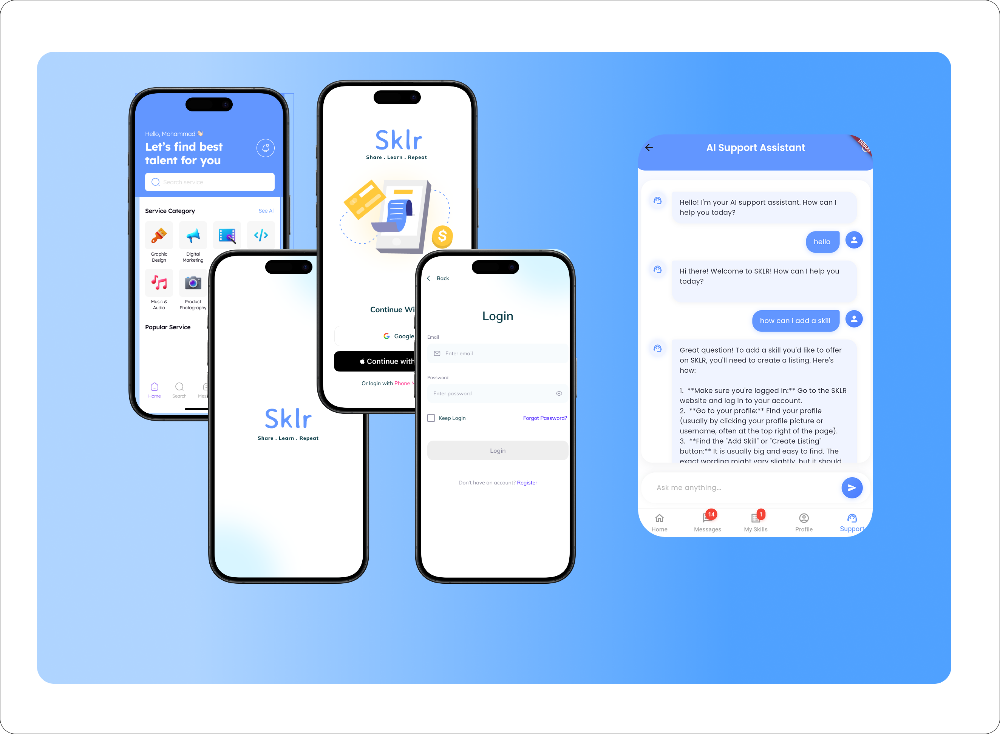

<div align="center">
  
  <h1>SKLR: Revolutionizing the Skill-Based Economy</h1>
</div>

<div align="center">
  
  
  
  
  
  
  
</div>

> **Share  Learn  Repeat**

## Overview

SKLR is a pioneering Skill-based Economy App dedicated to connecting talented individuals with opportunities and projects that match their expertise. By leveraging intelligent matchmaking, blockchain security, dynamic analytics, and cutting-edge AI, SKLR fosters a transparent and robust ecosystem where skills are valued as the ultimate currency.

## Project Status: Under Development

⚠️ **Please Note**: SKLR is currently under active development. While I'm excited to share our progress, please be aware that some features may be incomplete or subject to change.

## App Preview

Here's a sneak peek of SKLR in action:

<div align="center">
  
  
  
</div>

These screenshots represent the current progress. The final product may differ as I continue to refine and enhance the app based on testing and user feedback.

## Features

- **Real-Time Messaging:** Incorporated real-time synchronization in messaging with the help of Supabase.
- **Futuristic UI/UX:** Sleek, intuitive design for effortless navigation.
- **Real-Time Analytics:** Immediate insights into skill trends, opportunities, and user engagement.
- **Secure Transactions:** Blockchain-powered mechanisms ensuring safe and immutable exchanges.
- **Smart Recommendations:** AI-driven insights customized to user skills and market demands.
- **AI-Powered Support:** Integrated AI assistant using Google's Gemini 2.0 Pro model for real-time chat and support.
- **Multi-provider Authentication:** Secure sign-in options including email, Google, and Apple.

## Technologies Used

| Technology       | Description                                                              |
|------------------|--------------------------------------------------------------------------|
| Flutter/Dart     | Main UI framework for cross-platform mobile app development              |
| React/TypeScript | Used for web components with type safety                                 |
| Node.js          | Backend with Express.js framework                                        |
| Supabase         | Backend as a Service for real-time database functionality, authentication|
| Figma            | Used mainly for planning and designing the UI                            |
| OpenRouter AI API| Integration for advanced AI capabilities                                 |
| Google Gemini 2.0 Pro | AI model powering the intelligent support assistant                 |

## AI Integration

SKLR leverages cutting-edge AI technology to enhance user experience:

- **OpenRouter AI API:** Provides a seamless interface to access advanced AI models.
- **Google Gemini 2.0 Pro:** Powers our intelligent support assistant, offering real-time chat capabilities and smart recommendations.

This AI integration allows SKLR to provide personalized assistance, skill matching, and insights that evolve with user interactions and market trends.

## Getting Started

As SKLR is still in development, it can only be run locally at this time:

1. Clone the repository: ```git clone https://github.com/hamarshehmhmd/sklr.git```
2. Navigate to the project directory: ```cd sklr```
3. Install Dependencies: ```flutter pub get``` *** please ensure that you have flutter preinstalled on your device
4. Run the app locally: ```flutter run```


I appreciate your interest and patience as I work to deliver a polished, feature-complete version of SKLR.


## License

This project is licensed under the [MIT License](LICENSE).

## Figma Design

Check out our UI design: [Figma Link](https://www.figma.com/design/89T97CQIlNzEuWu7WIvWpq/SKLR_Group1?node-id=0-1&t=rwyJmYOgasuW5eAQ-1)

<div align="center">
  <a href="https://hamarshehmhmd.netlify.app/">Portfolio</a> -  
  <a href="mailto:mhh24001@student.mdu.se">Contact Me</a> -   
  <a href="https://linkedin.com/in/hamarshehmhmd">LinkedIn</a> 
</div>

